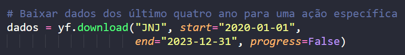
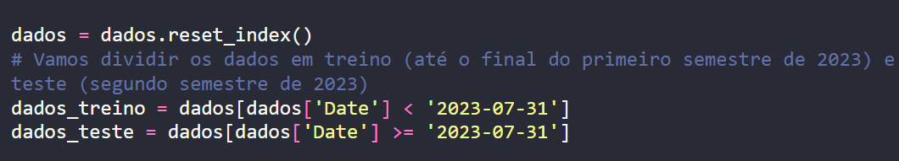
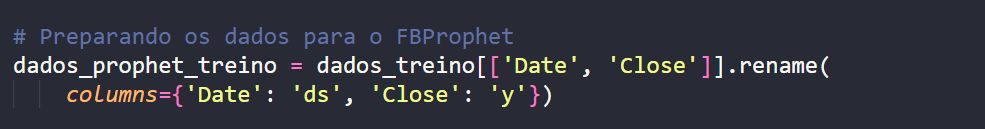
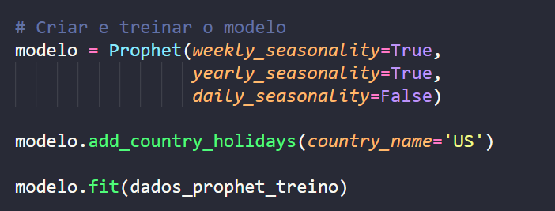
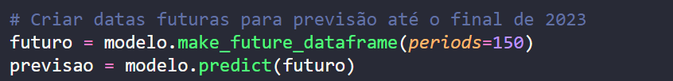
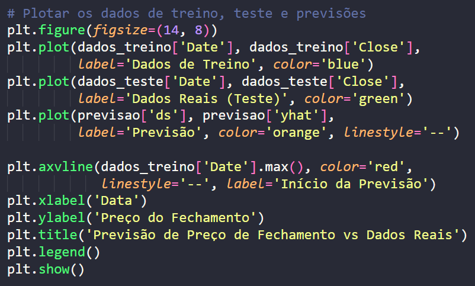
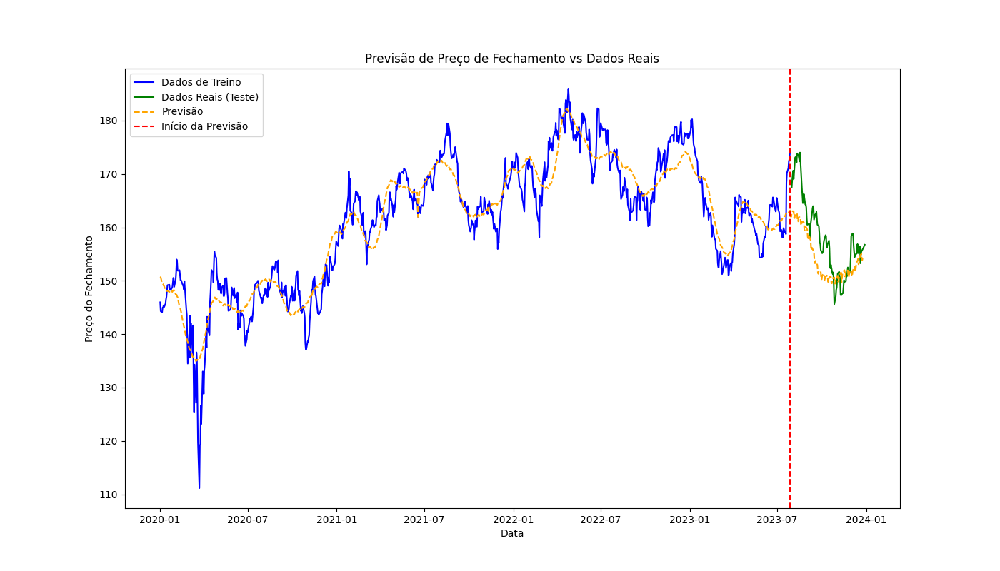

# analise_de_dados
Previsão de Preço de Ações usando o FBProphet 🪙

Este é um código simples para prever o preço de fechamento de uma ação usando uma biblioteca chamada FBProphet. Vamos explicar cada parte do código:

1. Importando Bibliotecas

Essas linhas importam bibliotecas que precisamos para baixar dados da internet, fazer previsões e plotar gráficos.

2. Baixando Dados da Ação

Essa linha baixa os dados de uma ação chamada "JNJ" (Johnson & Johnson) dos últimos quatro anos da internet.

3. Dividindo os Dados

Aqui, dividimos os dados em duas partes: dados de treino, usados para ensinar ao programa, e dados de teste, usados para ver quão boas são as previsões.

4. Preparando os Dados para o FBProphet

Nesta parte, ajustamos os dados para que o FBProphet possa entendê-los melhor.

5. Criando e Treinando o Modelo

Aqui, criamos um modelo de previsão e o ensinamos usando os dados de treino.

6. Fazendo Previsões

Esta parte cria datas futuras para as quais queremos fazer previsões e então faz as previsões com base no modelo que treinamos.

7. Plotando os Resultados

Por fim, este código plota um gráfico com os dados de treino, os dados reais de teste e as previsões que o modelo fez.

## Tecnologias utilizadas

- Python
- Bibliotecas
- Pandas
- yfinance
- matplotlib.pyplot
- prophet

# Previsão de Preço de Ações usando o FBProphet

Este é um código simples para prever o preço de fechamento de uma ação usando uma biblioteca chamada FBProphet. 

## Como Funciona

1. **Importando Bibliotecas**: Começamos importando as bibliotecas necessárias para baixar dados, fazer previsões e plotar gráficos.

2. **Baixando Dados da Ação**: Em seguida, baixamos os dados de uma ação específica da internet, usando a biblioteca `yfinance`.

3. **Dividindo os Dados**: Os dados são divididos em dois conjuntos: treino e teste. Os dados de treino são usados para ensinar ao programa, enquanto os dados de teste são usados para avaliar as previsões.

4. **Preparando os Dados para o FBProphet**: Os dados são ajustados para serem usados pelo FBProphet, uma biblioteca de previsão de séries temporais.

5. **Criando e Treinando o Modelo**: Um modelo de previsão é criado e treinado usando os dados de treino.

6. **Fazendo Previsões**: São criadas datas futuras para as quais queremos fazer previsões, e então o modelo faz as previsões com base nos dados de treino.

7. **Plotando os Resultados**: Por fim, um gráfico é gerado mostrando os dados de treino, os dados reais de teste e as previsões feitas pelo modelo.

## Como Usar

1. Clone este repositório para sua máquina local.
2. Certifique-se de ter todas as bibliotecas necessárias instaladas. Você pode instalá-las usando `pip install -r requirements.txt`.
3. Execute o script `previsao_acoes.py`.
4. Observe o gráfico gerado para ver as previsões de preço de fechamento da ação.

